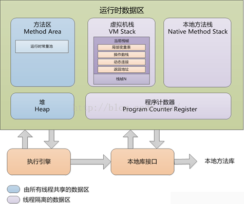

# Java虚拟机
> JVM(Java Virtual Machine)，java虚拟机。

## Java中的数据

### 数据类型

1. 基本类型

java中包含八种基本类型，布尔`boolean`、字节byte、字符char、浮点数float、双精度double、短整型short、整型int、长整型long。

2. 基本类型对应的封装类

java对基本的数据类型均做了封装，封装类分别为Boolean、Byte、Char、Float、Double、Short、Integer、Long.
这些数据类型，java提供了自动装箱和拆箱的操作。对象的数据类型中基本类型和封装类可以相互转换。注意对象的的引用可能为null，
而基本类型的变量均有默认值。null自动拆箱时，会报NullPointException。

3. 类

使用`class`关键字声明的类。如开发人员定义的`User`和系统提供的字符串操作类`StringBuffer`等。
```java
public class User{
    
    private String name;
    
    private String card;
    // ...
    
}
```
4. Class

JVM本身提供了一个java.lang.Class类，该类用于描述加载的类型的描述。JVM在启动时加载class时，会为每一个class生成一个Class对象实例。

### Java中的变量
java是强类型语言，任何变量的声明必须指定数据数据类型且初始化（基本类型存在默认值）。声明变量的位置和方式决定了变量的存活时间。

1. 局部变量

在代码块中声明的变量，包块静态代码块、构造代码块、方法体以及`{}`的代码块。

2. 成员变量

类的属性，在class声明声明未使用的static声明的变量。

3. 静态变量
类具有的共性，在class声明时，使用static关键是声明的变量。

4. 常量
声明时使用final关键字定义的变量，因其值在初始化之后不可改变，估成为常量。

## JVM 数据运行区
运行时数据去包括：方法区、堆、栈（虚拟机栈）、程序计数器、本地方法栈。其中虚拟机栈、本地方法栈、程序计数器属于线程隔离的数据区，
是单个线程私有的，它们的生命周期与线程相同；方法区和堆属于所有线程共享的数据区，是所有线程共享的。




其中：方法区(持久区)用来存储类的描述，堆用来存储储实例对象，栈用来存储对象引用和基本数据类型。方法区和堆用来存储，栈负责运行。
### 方法区
  - 存储内容
    - 静态变量
    - 常量
    - 类信息
    - 常量池
  
方法区是被所有线程共享，所有字段和方法字节码，以及一些特殊方法如构造函数，接口代码也在此定义。
简单说，所有定义的方法的信息都保存在该区域，此区域属于共享区间。

### 堆
  - 存储内容
    - 运行时生成的对象实例
  
堆这块区域是JVM中最大的，应用的对象和其数据都是存在这个区域。这块区域也是线程共享的，也是GC主要的回收区。一个JVM实例只存在一个堆内存，
堆内存的大小是可以调节的。类加载器读取了类文件后，需要把类、方法、常变量放到堆内存中，以方便执行器执行。

### 栈（虚拟机栈）

- 存储内容
  - 局部变量表，基本数据类型、reference 类型(对象引用)，returnAddress类型
  - 操作数栈
  - 动态链接
  - 方法出口
  
每次方法调用都会新建一个新的栈帧并把它压栈到栈顶。当方法正常返回或者调用过程中抛出未捕获的异常时，栈帧将出栈。
即方法从调用直至执行完成的过程，对应着一个栈帧在虚拟机中入栈到进栈的过程。栈Java程序的运行，是在线程创建时创建。
它的生命期是跟随线程的生命期，线程结束栈内存也就释放。对于栈来说不存在垃圾回收问题，只要线程一结束该栈就Over，
生命周期和线程一致，是线程私有的。基本类型的变量和对象的引用变量都是在函数的栈内存中分配。遵循“先进后出”/“后进先出”原则。

### 程序计数器

每个线程都有一个程序计算器，就是一个指针，指当前指令（或操作码）的地址，本地指令除外。
JVM 用程序计数器来跟踪指令执行的位置，程序计数器将实际上是指向方法区（Method Area）的一个内存地址。
由执行引擎读取下一条指令，是一个非常小的内存空间，几乎可以忽略不记。

### 本地方法栈

它的具体做法是Native Method Stack中登记native方法，在Execution Engine执行时加载native library。


## 堆
JVM的内存管理主要就是堆的内存管理。其中包含年轻代和老年代，年轻代又包含一个新生代和两个幸存区。
  - 年轻代
    - 新生代：新生对象的存放位置
    - 幸存区：经过GC之后的存活的对象
  - 老年代：经过多轮GC后依旧存活的对象，会被复制到老年代中。


## 参数设置

|内存分区      |最小值            |最大值            |备注    
|:------------|:----------------|:----------------|:------
|堆           |-Xms             |-Xmx             |        
|--年轻代      |-XX:NewSize      |-XX:MaxNewSize   |建议设为整个堆大小的1/3或者1/4,两个值设为一样大。     
|----新生代    |-XX:SurvivorRatio|-XX:SurvivorRatio|设置新生代的比例
|----幸存区    |-XX:NewRatio     |-XX:NewRatio     |      
|--老年代      |                 |                 |      
|栈           |-Xss             |-Xss             |
|方法区        |-XX:PermSize     |-XX:MaxPermSize  |