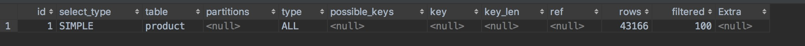

# Explain

## 使用

```sql
 explain select filed \[,filed] from table \[where condition \[AND|OR condition]]
```

## 结果



### id 
> 查询编号
## select_type 
> 查询类型
  
  - SIMPLE：简单SELECT(不使用UNION或子查询等)
  
  - PRIMARY：最外面的SELECT
  
  - UNION：UNION中的第二个或后面的SELECT语句
  
  - DEPENDENT UNION：UNION中的第二个或后面的SELECT语句，取决于外面的查询
  
  -  UNION RESULT：UNION的结果。
  
  - SUBQUERY：子查询中的第一个SELECT
  
  - DEPENDENT SUBQUERY：子查询中的第一个SELECT，取决于外面的查询
  
  - DERIVED：导出表的SELECT(FROM子句的子查询)
 
### table 
> 查询表

### partitions 
> 
### type
> 这列最重要，显示了连接使用了哪种类别,有无使用索引，是使用Explain命令分析性能瓶颈的关键项之一。优 > 劣： `system > const > eq_ref > ref > fulltext > ref_or_null > index_merge >
 unique_subquery > index_subquery > range > index > ALL`。一般保证查询至少达到range级别，最好能达到ref，否则就可能会出现性能问题。

  - system: 表中只有一条数据，这个类型是特殊的const 类型。
  - const: 针对主键或唯一索引的等值查询扫描，最多只返回一行数据。 const 查询速度非常快， 因为它仅仅读取一次即可。例如下面的这个查询，它使用了主键索引，因此 type 就是 const 类型的：explain select * from user_info where id = 2；
  - eq_ref: 此类型通常出现在多表的 join 查询，表示对于前表的每一个结果，都只能匹配到后表的一行结果。并且查询的比较操作通常是 =，查询效率较高。例如：explain select * from user_info, order_info where user_info.id = order_info.user_id;
  - ref: 此类型通常出现在多表的 join 查询，针对于非唯一或非主键索引，或者是使用了 最左前缀 规则索引的查询。例如下面这个例子中， 就使用到了 ref 类型的查询：explain select * from user_info, order_info where user_info.id = order_info.user_id AND order_info.user_id = 5
  - range: 表示使用索引范围查询，通过索引字段范围获取表中部分数据记录。这个类型通常出现在 =, <>, >, >=, <, <=, IS NULL, <=>, BETWEEN, IN() 操作中。例如下面的例子就是一个范围查询：explain select * from user_info where id between 2 and 8；
  - index: 表示全索引扫描(full index scan)，和 ALL 类型类似，只不过 ALL 类型是全表扫描，而 index 类型则仅仅扫描所有的索引， 而不扫描数据。index 类型通常出现在：所要查询的数据直接在索引树中就可以获取到, 而不需要扫描数据。当是这种情况时，Extra 字段 会显示 Using index。
  - ALL: 表示全表扫描，这个类型的查询是性能最差的查询之一。通常来说， 我们的查询不应该出现 ALL 类型的查询，因为这样的查询在数据量大的情况下，对数据库的性能是巨大的灾难。 如一个查询是 ALL 类型查询， 那么一般来说可以对相应的字段添加索引来避免。

### possible_keys
> 可能使用到的索引

### key 使用到的索引

### key_len
 > 健长度。在不损失精确性的情况下，长度越短越好 

### ref 饮用的值

### rows 扫描行书

### filtered 

### extra
> 详细信息

  - Distinct
    > 一旦MYSQL找到了与行相联合匹配的行，就不再搜索了

  - Not exists
    > MYSQL 优化了LEFT JOIN，一旦它找到了匹配LEFT JOIN标准的行，就不再搜索了

  - Range checked for each

  - Record（index map:#）
    > 没有找到理想的索引，因此对于从前面表中来的每一 个行组合，MYSQL检查使用哪个索引，并用它来从表中返回行。这是使用索引的最慢的连接之一

  - Using filesort
    > 看到这个的时候，查询就需要优化了。MYSQL需要进行额外的步骤来发现如何对返回的行排序。它根据连接类型以及存储排序键值和匹配条件的全部行的行指针来 排序全部行

  - Using index
    > 列数据是从仅仅使用了索引中的信息而没有读取实际的行动的表返回的，这发生在对表 的全部的请求列都是同一个索引的部分的时候

  - Using temporary
    > 看到这个的时候，查询需要优化了。这 里，MYSQL需要创建一个临时表来存储结果，这通常发生在对不同的列集进行ORDER BY上，而不是GROUP BY上

  - Using where
    > 使用了WHERE从句来限制哪些行将与下一张表匹配或者是返回给用户。如果不想返回表中的全部行，并且连接类型ALL或index， 这就会发生，或者是查询有问题


*备注：* 当type为index时，并且Extra为Using Index，表明使用了覆盖索引。