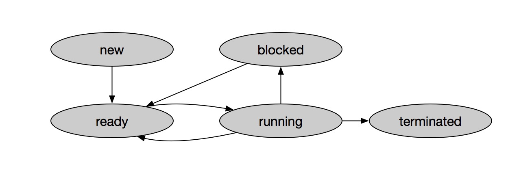
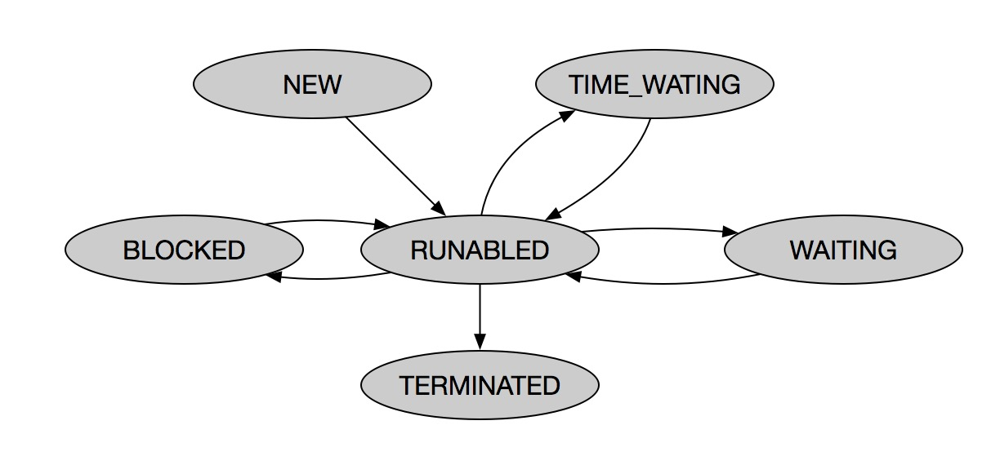
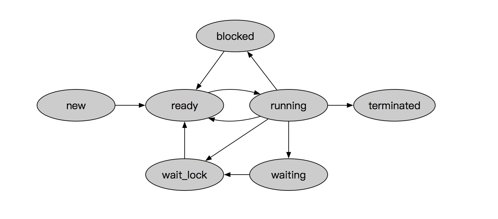

# Thread
线程

## 创建线程
无论使用什么方式使用线程都需要，完成以下三步
1. 定义执行体；
1. 创建线程```new Thread()```，不同的实现方式，在创建线程的时候会传入不同的参数；
1. 启动线程`thread.start()`。

### 实现方式
这里的实现方式，我的理解是指线程执行内容的实现方式。
1. 继承`java.lang.Thread`
    1. 定义：定义类[ExtendThread](./src/main/java/com/albenyuan/thread/ExtendThread.java)继承`java.lang.Thread`，
    并重写`run()`方法;
    1. 使用：
        ```java
       new ExtendThread().start();
       ```
1. 实现`java.lang.Runnable`
    1. 定义：定义类[RunnableThread](./src/main/java/com/albenyuan/thread/RunnableThread.java)，实现`java.lang.Runnable`接口，实现`run()`方法;
    1. 使用：
        ```java
        Runnable runnable = new RunableThread();
        new Thread(runnable).start();
        ```
1. 实现`java.util.concurrent.Callable<T>`

    该方式实现需要使用到`java.util.concurrent.FutureTask<T>`，线程在执行后可以返回线程的执行结果。
    
    1. 定义：定义类[CallableThread](./src/main/java/com/albenyuan/thread/CallableThread.java)，
    实现`java.util.concurrent.Callable<T>`接口，并实现`T call()`方法；
    1. 使用：
        ```java
        Callable callable =new CallableThread();
        FutureTask futureTask = new FutureTask<Integer>(callable);
        new Thread(futureTask).start();
        Integer value = fetureTask.get();
        ```

备注：[ThreadTest](./src/test/java/com/albenyuan/thread/ThreadTest.java) 给出了各个方式的创建和启动方式。
        
        
## 比较

### java.lang.Thread

#### 优势

1. 编程简单；
1. 可使用`this`访问当前线程。

#### 劣势

1. 已经继承Thread类，不支持再继承其他类；
1. 无法直接返回处理结果。

### java.lang.Runnable

#### 优势

1. 支持继承其他类；
1. 可以共享同一资源。

#### 劣势

1. 无法直接返回处理结果；
1. 不能直接使用`this`访问当前线程，建议使用`Thread.currentThread()`访问当前线程。


### java.util.concurrent.Callable\<T>

#### 优势

1. 支持继承其他类；
1. 可以共享同一资源；
1. 可以返回处理结果。

#### 劣势

1. 不能直接使用`this`访问当前线程，建议使用`Thread.currentThread()`访问当前线程；
1. 需要和`java.util.concurrent.FutureTask<T>`联合使用。


# 线程的方法
线程中使用的方法：`java.lang.Thread`实现、继承于`java.lang.Objec`实现的方法。


## java.lang.Object

- `public void wait()`、`public void wait(long)`

    使线程进入等待池，等待时间完毕或者被唤起。

- `public void nofity()`、`public void nofityAll()`

    唤起等待池中的线程，进入锁竞争池中竞争获取锁。


## java.lang.Thread的方法

### 静态方法
- `public static int activeCount()`
    
    获取当前线程组中的active线程数量。
    
- `public static native void yield()`

    线程让步，声明当前线程可退让资源。只是声明，是否让步有系统决定。

- `public static native Thread currentThread()`
    
    获取当前执行的线程对象。

- `public static native void sleep(long millis)`、`public static void sleep(long millis, int nanos)`
    
    使当前线程休眠millis毫秒的时长+nanos纳秒的时长。此方方法进行了重载，支持不穿入第二个参数。

### 非静态行为

- `public void start()`
    
    启动线程，
    
- `public void run()` 
    
    线程的执行体，
    
- `public final void join()`、`public final synchronized void join(long millis)`    

    阻塞当前线程，知道子线程执行完毕或者阻塞超时。其内部调用了

- `public long getId()` 

    获取线程的id
    
- `public void interrupt()`

    中断线程

- `public boolean isInterrupted()`

    返回线程中断状态，true：线程已中断，false：线程未中断


- `public State getState()`

    获取线程的状态：
    - `State.NEW`：新建
    - `State.RUNNABLE`：正在执行        
    - `State.BLOCKED`：锁阻塞
    - `State.WAITING`：等待且未设置超时时间
    - `State.TIMED_WAITING`：等待且设置了超时时间
    - `State.TERMINATED`：终结
   
- `public final void setPriority(int newPriority)`、`public final void getPriority()`

    获取线程的优先级

- `public final synchronized void setName(String name)`、`public final String getName()`

    设置/获取线程的名字

- `public final native boolean isAlive()`

    线程是否是活跃状态
    
-  ~~public void destroy()~~ 

    销毁线程，已经`@Deprecated`，且不支持了。

-  ~~public final void resume()~~ 

    重启线程，已经`@Deprecated`，且不支持了。

-  ~~public final void suspend()~~

    暂停线程，已经`@Deprecated`，且不支持了。


# 线程的状态

## 系统中的线程

### 线程的状态



- new： 新建，线程在创建，系统分配资源。

- ready：就绪，当前的调度实例在可执行队列中，随时可以被切换到占用处理器的运行状态；

- running：运行，当前的调度实例，正在占用处理器运行中；

- blocked：阻塞，当前的调度实例在等待相应的资源；

- terminated：终止，结束状态，释放操作系统分配的资源。

### 状态转化

- new -> ready

    系统创建线程后，无需等待其他资源，可直接进入可执行队列，等待cpu资源。

- ready-> running

    线程获取到cpu资源，开始运行。
    
- running -> ready

    时间片消耗完毕、其他线程抢占cpu资源导致当前调度退出cpu。

- running -> blocked

    当前调度需要等待获取到io、其他线程资源、或者`sleep`。

- blocked -> ready

    获取到对应的资源、被唤起、到时唤起。

- running -> terminated 

    调度执行完毕，系统回收资源。

## java.lang.Thread.State

### 线程的状态



- `State.NEW`

    > Thread state for a thread which has not yet started.
    
    > 线程状态：一个还未开始的线程。

    新建状态，还未启动。`Thread`实力已经创建，但还没有调用`start()`方法。
        
- `State.RUNNABLE`

    > Thread state for a runnable thread. A thread in the runnable state is executing in the Java virtual machine but it may be waiting for other resources from the operating system such as processor. 
    
    > 线程状态：一个运行状态的。一个在运行状态线的线程，指的是正在JVM上执行，但有可能正在等待其他系统资源，如：处理器。
   
   已经调用了`start()`、正在CPU上执行、等待操作系统资源。
        
- `State.BLOCKED` 

    > Thread state for a thread blocked waiting for a monitor lock.
    
    > 线程状态：一个正在等待监视锁而阻塞的线程。

    等待锁，等待对象锁，等待代码块锁。（理解有些偏颇，待考究）。
    
- `State.WAITING` 

    > Thread state for a waiting thread.
    
    > 线程状态：一个正在等待的线程。
    
    调用了`Object.wait()`、`Thread.join()`、`LockSupport.park()`方法。
    
- `State.TIMED_WAITING`

    > Thread state for a waiting thread with a specified waiting time.
    
    > 线程状态：一个正在等待，且拥有等待时长的线程。
    
    调用了`Object.wait(long)`、`Thread.join(long)`、`Thread.sleep(long)`、`LockSupport.parkNanos()`、`LockSupport.parkUntil()`方法。
    
- `State.TERMINATED`
    
    > Thread state for a terminated thread.
    
    > 线程状态：一个终结的线程。
   
    执行结束的线程。
    
### 线程的转化

- new -> runnable

    - 调用了`thread.start()`

 
- runnable -> blocked
    
    - 等待监视锁，为了进入`synchronized`代码块、等待锁进入


- blocked -> runnable

    - 获取监视锁，可以执行`synchronized`代码块
    
    
- runnable -> waiting

    - 调用了`obj.wait()`；
    - 调用了`thread.join()`；
    - 调用了`LockSupport.park()`；

- runnable -> timed_waiting

    - 调用了`Thread.sleep(long)`；
    - 调用了`obj.wait(long)`；
    - 调用了`thread.join(long)`；
    - 调用了`LockSupport.parkNanos(long)`；
    - 调用了`LockSupport.parkUntil(long)`。


- waiting -> runnable

    - 调用了`obj.notify()`；
    - 调用了`obj.notifyAll()`；
    - thread执行完毕，即：terminated；
    - 调用了`LockSupport.unpark()`。

- timed_waiting -> runnable

    - 等待/睡眠时间完毕

- running -> terminated 

    - 运行结束
    
    - 抛出未捕获异常

## 系统+Java结合理解
系统中的状态线程状态，着中描述里线程获取cpu和系统资源时中间的切换，java中的状态赵中描述了线程在业务级别等待和获取监视锁的切换。
根据两者我们可以将线程分为以下状态



### 对象锁

在java中每一个对象都会自带一把线程锁，和一个锁竞争池，锁等待池。
    
- 锁竞争池：池中的线程，都有机会获得该对象的锁。

- 锁等待池：池中的线程，只能等待该对象调用`notify()`、`notifyAll()，`来唤起池中一个、全部线程进去锁池。
    
    - notify()：通知等待池中随机的一个线程进入锁竞争池。
    
    - notifyAll()：通知锁等待池中的全部线程进入锁竞争池。

### 线程状态

- new
    
    线程创建，但还未调用`start()`方法

- ready
    
    就绪状态，等待CPU资源，获取到cup资源后即可运行计算
    
    - 线程启动后获取到相应资源，锁，进入就绪状态，等待获取到cpu资源。
    
    - 在运行状态下`Thread.yield()`，而且退让了cpu，进入就绪状态。
    
- running

   线程获取到cpu资源，正在运行计算。

- blocked

    线程阻塞，调用了`Thread.sleep(long)`方法、IO阻塞，网络阻塞

- waiting
    
    在锁等待池中，等待唤醒去竞争获取锁。
    
    - 调用了`obj.wait()`、`obj.wait(long)`方法；
    
    - 调用了`thrad.join()`、`thrad.join(long)`方法。
    
   

- wait-lock

    在锁竞争池中，竞争对象锁。
    
    - 调用了`obj.notify()`、`thread.notifyAll()`方法；
    
    - 调用`thread.join()`、`thrad.join(long)`后，thread线程执行结束。

- terminated

    线程运行结束。
    
    - 代码快执行完毕；
    
    - run()发生未捕获的异常。
    
   
### 说明    
备注：`java.util.concurrent.locks`的类还没有理解透彻，部分暂时未加入以上状态变化。后续会作出相应的补充。


## 线程间的通信方式

- wait/notify

  - wait()/wait(long)

    没有需要的数据时，线程进入等待

  - notify()/ notifyAll()
    
    产生数据后，通知等待线程
  
  
- pipe 管道

  - PipeInputStream/PipeReader

    通过管道，读取数据
 
  - PipeWriterPipeOutputStream/PipeWriter
    
    通过管道、写入数据

